# Copilot Sidebar 사용자 매뉴얼

> **버전**: v1.0.0 | **최종 수정**: 2026-03-04
> 이 매뉴얼은 Obsidian Copilot Sidebar 플러그인의 모든 GUI 기능을 단계별로 안내합니다.
> 키보드 단축키 없이 마우스 클릭만으로 사용하는 방법을 설명합니다.

---

## 목차

1. [플러그인 활성화](#1-플러그인-활성화)
2. [사이드바 열기](#2-사이드바-열기)
3. [인터페이스 전체 구조](#3-인터페이스-전체-구조)
4. [인증 상태 확인](#4-인증-상태-확인)
5. [컨트롤 버튼 바](#5-컨트롤-버튼-바)
6. [채팅 메시지 입력 및 전송](#6-채팅-메시지-입력-및-전송)
7. [현재 노트에 대해 질문하기](#7-현재-노트에-대해-질문하기)
8. [세션 관리](#8-세션-관리)
9. [컨텍스트 노트 관리](#9-컨텍스트-노트-관리)
10. [변경사항 관리](#10-변경사항-관리-preview--apply--discard--undo)
11. [설정 패널](#11-설정-패널)
12. [진단 정보 및 피드백 캡처](#12-진단-정보-및-피드백-캡처)
13. [전체 사용 흐름 요약](#13-전체-사용-흐름-요약)

---

## 1. 플러그인 활성화

Obsidian에서 Copilot Sidebar를 처음 사용하려면 커뮤니티 플러그인을 활성화해야 합니다.

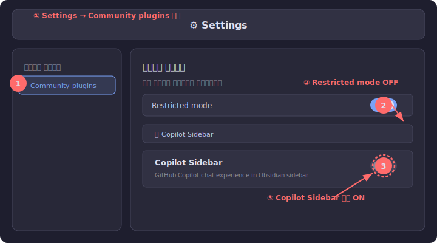

### 실행 순서

| 단계 | 동작 | 설명 |
|:---:|------|------|
| ① | **Settings → Community plugins** 이동 | Obsidian 좌측 하단 ⚙ (설정 아이콘) 클릭 → 왼쪽 메뉴에서 "Community plugins" 선택 |
| ② | **Restricted mode OFF** | 보안 모드를 꺼야 커뮤니티 플러그인을 사용할 수 있습니다 |
| ③ | **Copilot Sidebar 토글 ON** | 플러그인 목록에서 "Copilot Sidebar"를 찾아 토글 스위치를 켭니다 |

> ⚠️ 플러그인이 목록에 없다면, `Browse` 버튼을 클릭하여 커뮤니티 플러그인 마켓에서 "Copilot Sidebar"를 검색하여 설치하세요.

---

## 2. 사이드바 열기

플러그인을 활성화한 후, 사이드바를 여는 방법입니다.

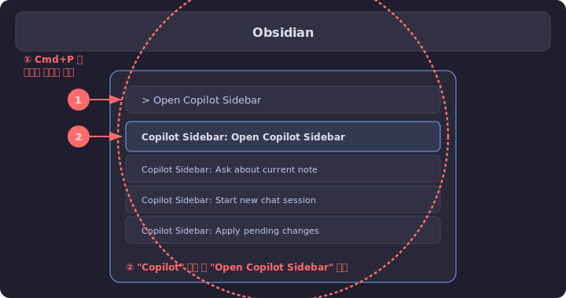

### 실행 순서

| 단계 | 동작 | 설명 |
|:---:|------|------|
| ① | **명령어 팔레트 열기** | `Cmd+P` (Mac) 또는 `Ctrl+P` (Windows)로 명령어 팔레트를 엽니다 |
| ② | **"Copilot" 검색 후 선택** | "Copilot"을 입력하면 관련 명령어 목록이 나타납니다. **"Copilot Sidebar: Open Copilot Sidebar"** 를 클릭합니다 |

> 💡 한번 열린 사이드바는 Obsidian 우측 패널에 고정됩니다. 다음부터는 우측 패널 탭을 클릭하여 다시 열 수 있습니다.

---

## 3. 인터페이스 전체 구조

사이드바는 크게 4개 영역으로 구성됩니다.

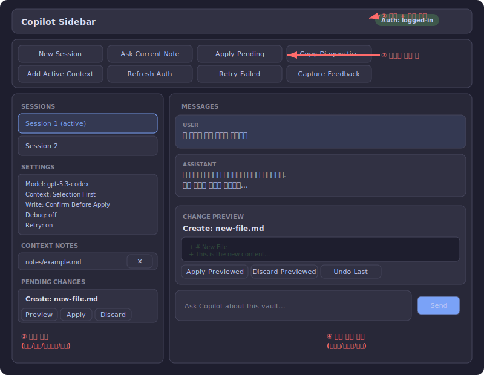

### 영역 설명

| 영역 | 위치 | 내용 |
|:---:|------|------|
| ① | **헤더** (상단) | 플러그인 제목 + 인증 상태 뱃지 |
| ② | **컨트롤 바** (헤더 아래) | 8개 기능 버튼 (3열 그리드) |
| ③ | **좌측 패널** | 세션 목록, 설정, 컨텍스트 노트, 대기 변경사항 |
| ④ | **우측 채팅 패널** | 메시지 목록, 변경 프리뷰, 메시지 입력창 |

> 💡 화면 너비가 760px 이하이면 좌우 패널이 상하 구조로 자동 전환됩니다.

---

## 4. 인증 상태 확인

사이드바 상단 우측에 현재 GitHub 인증 상태가 뱃지로 표시됩니다.

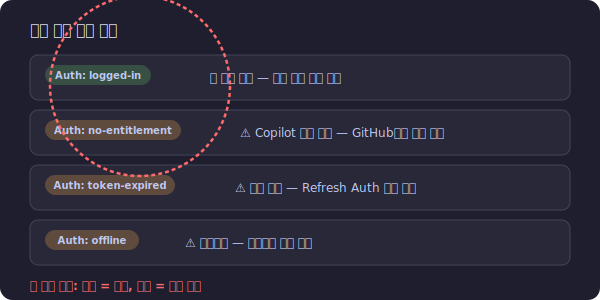

### 뱃지 유형

| 뱃지 | 색상 | 의미 | 조치 |
|------|:---:|------|------|
| `Auth: logged-in` | 🟢 초록 | 정상 인증 완료 | 모든 기능 사용 가능 |
| `Auth: no-entitlement` | 🟠 주황 | Copilot 구독 없음 | [github.com/settings](https://github.com/settings) 에서 Copilot 구독 |
| `Auth: token-expired` | 🟠 주황 | 인증 토큰 만료 | **Refresh Auth** 버튼 클릭 |
| `Auth: offline` | 🟠 주황 | 네트워크 연결 안 됨 | 인터넷 연결 확인 후 **Refresh Auth** |

> 💡 인증은 시스템에 설치된 GitHub CLI (`gh`)를 사용합니다. 먼저 터미널에서 `gh auth login`으로 로그인되어 있어야 합니다.

---

## 5. 컨트롤 버튼 바

사이드바 상단에 8개의 기능 버튼이 3열 그리드로 배치되어 있습니다.

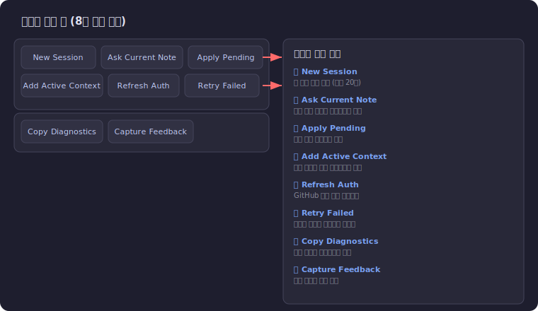

### 버튼별 기능

| 버튼 | 기능 | 상세 설명 |
|------|------|----------|
| **New Session** | 새 채팅 세션 시작 | 최대 20개 세션까지 생성 가능. 각 세션은 독립된 대화 기록을 가짐 |
| **Ask Current Note** | 현재 노트 질문 | 에디터에 열린 노트 전체를 컨텍스트로 포함하여 AI에 질문 |
| **Apply Pending** | 변경사항 적용 | 대기 중인 첫 번째 변경사항을 파일에 적용 |
| **Add Active Context** | 컨텍스트 추가 | 현재 활성 노트를 추가 컨텍스트 목록에 등록 |
| **Refresh Auth** | 인증 새로고침 | GitHub 인증 상태를 수동으로 다시 확인 |
| **Retry Failed** | 재시도 | 마지막으로 실패한 프롬프트를 다시 전송 |
| **Copy Diagnostics** | 진단 복사 | 성능/오류 진단 요약을 클립보드에 복사 |
| **Capture Feedback** | 피드백 캡처 | 베타 피드백 노트를 자동 생성하여 볼트에 저장 |

---

## 6. 채팅 메시지 입력 및 전송

AI와 대화하는 기본 인터페이스입니다.

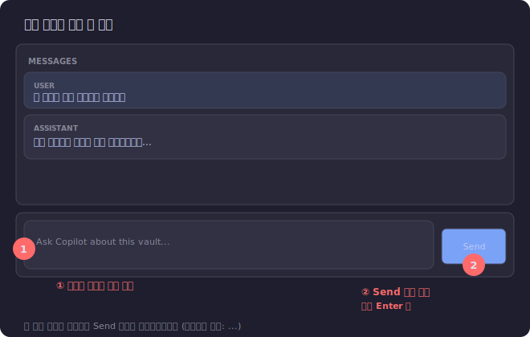

### 실행 순서

| 단계 | 동작 | 설명 |
|:---:|------|------|
| ① | **텍스트 영역에 질문 입력** | 우측 패널 하단의 입력창에 질문을 타이핑합니다. 플레이스홀더: "Ask Copilot about this vault..." |
| ② | **Send 버튼 클릭** | 입력창 오른쪽의 **Send** 버튼을 클릭합니다. 또는 `Enter` 키를 눌러도 전송됩니다 |

### 응답 수신

- AI 응답은 **스트리밍 방식**으로 실시간 표시됩니다
- 응답 중에는 입력창과 Send 버튼이 **비활성화**됩니다 (회색 처리)
- 스트리밍 중 메시지 내용은 `...`으로 표시됩니다
- 메시지에는 **USER** 또는 **ASSISTANT** 역할 뱃지가 표시됩니다

> 💡 `Shift+Enter`로 줄바꿈을 할 수 있습니다. `Enter`만 누르면 전송됩니다.

---

## 7. 현재 노트에 대해 질문하기

에디터에 열린 노트를 AI에게 바로 분석시킬 수 있습니다.

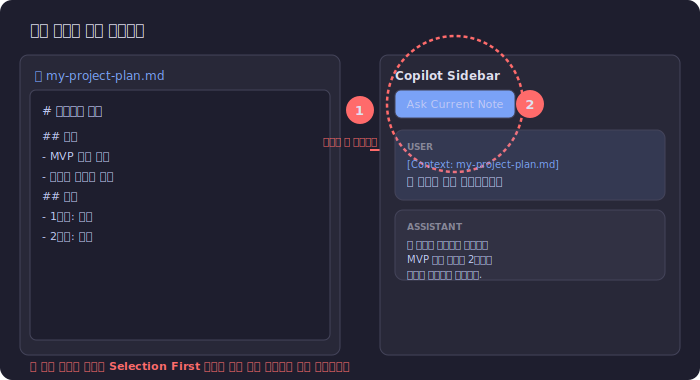

### 실행 순서

| 단계 | 동작 | 설명 |
|:---:|------|------|
| ① | **분석할 노트를 에디터에서 열기** | 질문하고 싶은 노트를 Obsidian 에디터에서 엽니다 |
| ② | **"Ask Current Note" 버튼 클릭** | 사이드바 컨트롤 바에서 버튼을 클릭합니다 |

### 컨텍스트 정책

설정의 **Context Policy**에 따라 전달되는 내용이 달라집니다:

| 정책 | 동작 |
|------|------|
| **Selection First** | 텍스트 선택 영역이 있으면 선택 영역만 전달, 없으면 노트 전체 |
| **Note Only** | 항상 노트 전체 내용을 전달 |

> 💡 노트의 파일 경로가 메시지에 `[Context: filename.md]` 형태로 표시됩니다.

---

## 8. 세션 관리

여러 주제의 대화를 독립 세션으로 관리할 수 있습니다.

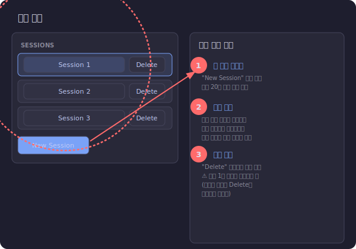

### 실행 순서

| 작업 | 동작 | 설명 |
|------|------|------|
| **새 세션 만들기** | **"New Session"** 버튼 클릭 | 새로운 빈 대화 세션이 생성되고 자동 전환됩니다 |
| **세션 전환** | 세션 이름 버튼 클릭 | 목록에서 원하는 세션을 클릭하면 해당 대화 내용으로 전환됩니다 |
| **세션 삭제** | 세션 옆 **"Delete"** 버튼 클릭 | 해당 세션과 모든 대화 기록이 삭제됩니다 |

### 주의사항

- **최대 20개** 세션까지 관리할 수 있습니다
- **최소 1개** 세션은 항상 유지되어야 합니다 (마지막 세션의 Delete 버튼은 비활성화)
- 현재 활성 세션은 **파란색 테두리**로 강조 표시됩니다

---

## 9. 컨텍스트 노트 관리

AI 질문 시 참조할 추가 노트를 등록할 수 있습니다.

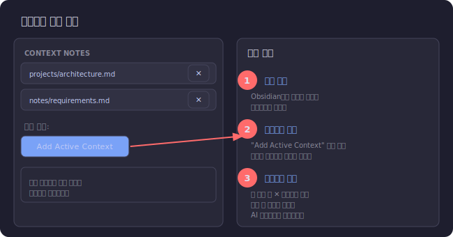

### 실행 순서

| 단계 | 동작 | 설명 |
|:---:|------|------|
| ① | **노트를 에디터에서 열기** | 추가하려는 노트를 Obsidian에서 엽니다 |
| ② | **"Add Active Context" 클릭** | 컨트롤 바에서 버튼을 클릭하면 현재 노트가 목록에 추가됩니다 |
| ③ | **제거 시 ✕ 버튼 클릭** | 각 노트 옆의 ✕ 버튼으로 컨텍스트에서 제거합니다 |

### 작동 원리

- 등록된 컨텍스트 노트의 내용은 AI에게 보내는 모든 질문에 **자동 포함**됩니다
- 여러 개의 노트를 동시에 등록할 수 있습니다
- 현재 열린 노트 + 등록된 컨텍스트 노트가 함께 AI에게 전달됩니다
- 노트 경로가 `좌측 패널 > CONTEXT NOTES` 섹션에 표시됩니다

---

## 10. 변경사항 관리 (Preview → Apply / Discard / Undo)

AI가 제안한 파일 변경사항을 검토하고 적용할 수 있습니다.

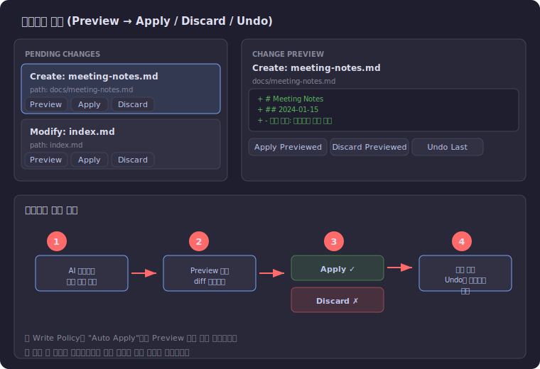

### 실행 순서

| 단계 | 동작 | 설명 |
|:---:|------|------|
| ① | **AI 응답에서 변경 제안 수신** | AI가 파일 생성/수정을 제안하면 좌측 PENDING CHANGES에 표시됩니다 |
| ② | **"Preview" 버튼 클릭** | 변경사항의 diff(차이점)를 우측 프리뷰 패널에서 확인합니다 |
| ③-A | **"Apply" 클릭 → 적용** | 변경사항을 실제 파일에 적용합니다 |
| ③-B | **"Discard" 클릭 → 취소** | 변경사항을 폐기합니다 |
| ④ | **"Undo Last" 클릭 → 되돌리기** | 마지막으로 적용한 변경을 원래대로 되돌립니다 |

### 프리뷰 패널

| 요소 | 설명 |
|------|------|
| **변경 유형** | `Create` (새 파일 생성) 또는 `Modify` (기존 파일 수정) |
| **파일 경로** | 변경 대상 파일의 볼트 내 경로 |
| **Diff 뷰** | `+` 초록색: 추가되는 내용, `-` 빨간색: 삭제되는 내용 (최대 120줄) |
| **Apply Previewed** | 프리뷰 중인 변경사항 적용 |
| **Discard Previewed** | 프리뷰 중인 변경사항 폐기 |
| **Undo Last** | 마지막 적용 되돌리기 (적용 이력이 없으면 비활성화) |

### Write Policy에 따른 동작

| 정책 | 동작 |
|------|------|
| **Confirm Before Apply** (기본값) | Preview로 확인 후 수동 Apply |
| **Auto Apply** | AI 제안 즉시 자동 적용 (Preview 단계 건너뜀) |

> ⚠️ 적용 전에 파일이 외부에서 수정된 경우, 충돌 방지를 위해 적용이 **자동 차단**됩니다.

---

## 11. 설정 패널

좌측 패널의 SETTINGS 섹션에서 플러그인 동작을 제어할 수 있습니다.

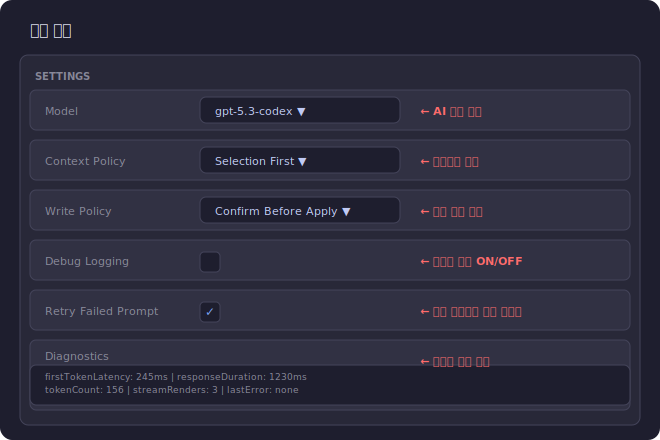

### 설정 항목

| 설정 | UI 요소 | 옵션 | 설명 |
|------|:-------:|------|------|
| **Model** | 드롭다운 | `gpt-5.3-codex`, `gpt-4.1`, `gpt-4o-mini` 등 | AI 모델 선택 |
| **Context Policy** | 드롭다운 | `Selection First`, `Note Only` | 텍스트 선택 우선 또는 노트 전체 |
| **Write Policy** | 드롭다운 | `Confirm Before Apply`, `Auto Apply` | 변경 적용 시 확인 여부 |
| **Debug Logging** | 체크박스 | ON / OFF | 개발자 콘솔에 디버그 로그 출력 |
| **Retry Failed Prompt** | 체크박스 | ON / OFF | 실패한 프롬프트 자동 재시도 |

### 읽기 전용 정보

| 항목 | 표시 내용 |
|------|----------|
| **Last Failed Prompt** | 마지막 실패 프롬프트 미리보기 (120자 제한) |
| **Last Feedback Note** | 마지막 생성된 피드백 노트 경로 |
| **Diagnostics** | 실시간 성능/오류 진단 박스 |

### 진단 정보 (Diagnostics Box)

| 메트릭 | 설명 |
|--------|------|
| `firstTokenLatency` | 첫 응답 토큰까지의 지연시간 (ms) |
| `responseDuration` | 전체 응답 소요시간 (ms) |
| `responseTokenCount` | 응답 토큰 수 |
| `streamRenderCount` | 스트림 렌더링 횟수 |
| `lastErrorCategory` | 마지막 오류 카테고리 |
| `lastErrorMessage` | 마지막 오류 상세 메시지 |
| `lastUpdate` | 마지막 업데이트 타임스탬프 |

---

## 12. 진단 정보 및 피드백 캡처

문제 보고나 성능 확인을 위한 도구입니다.


### 진단 정보 복사

| 단계 | 동작 |
|:---:|------|
| ① | **"Copy Diagnostics"** 버튼 클릭 |
| ② | 클립보드에 진단 요약이 복사됨 → 원하는 곳에 붙여넣기 |

### 베타 피드백 캡처

| 단계 | 동작 |
|:---:|------|
| ① | **"Capture Feedback"** 버튼 클릭 |
| ② | `Copilot Sidebar Feedback/feedback-<timestamp>.md` 파일이 자동 생성됨 |

### 생성되는 피드백 노트 내용

- **Diagnostics Snapshot**: 현재 성능/오류 진단 정보
- **Recent Chat Excerpts**: 최근 대화 내용 발췌 (메시지당 200자 제한)
- 생성된 파일 경로는 설정 패널의 **Last Feedback Note**에 표시됩니다

---

## 13. 전체 사용 흐름 요약

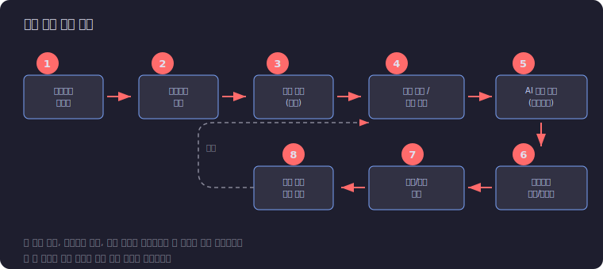

### 기본 사용 흐름

```
① 플러그인 활성화
    ↓
② 사이드바 열기 (Cmd+P → Open Copilot Sidebar)
    ↓
③ 인증 확인 (Auth: logged-in 뱃지 확인)
    ↓
④ 질문 입력 또는 Ask Current Note
    ↓
⑤ AI 응답 수신 (스트리밍)
    ↓
⑥ 변경사항 확인 → Preview
    ↓
⑦ 적용(Apply) / 취소(Discard) 결정
    ↓
⑧ 추가 질문 또는 완료
    ↗ (반복)
```

### 언제든 사용 가능한 기능

| 기능 | 버튼 |
|------|------|
| 새 주제로 대화 시작 | **New Session** |
| 참고 노트 추가 | **Add Active Context** |
| 설정 변경 | SETTINGS 패널의 드롭다운/체크박스 |
| 인증 문제 해결 | **Refresh Auth** |
| 실패한 질문 재시도 | **Retry Failed** |
| 디버깅 정보 확인 | **Copy Diagnostics** |
| 피드백 제출 | **Capture Feedback** |

---

## 문제 해결 (Troubleshooting)

| 증상 | 해결 방법 |
|------|----------|
| 사이드바가 보이지 않음 | `Cmd+P` → "Open Copilot Sidebar" 실행 |
| Auth 뱃지가 주황색 | 터미널에서 `gh auth login` 실행 후 **Refresh Auth** |
| Send 버튼이 회색 | AI가 응답 중 (스트리밍 완료까지 대기) |
| 변경 적용 실패 | 파일이 외부 수정됨. 노트를 닫았다 열고 다시 시도 |
| Delete 버튼이 비활성화 | 마지막 남은 세션은 삭제 불가. New Session 후 삭제 |

---

> 📝 이 매뉴얼의 이미지는 실제 UI를 기반으로 한 와이어프레임 목업입니다.
> Obsidian 테마에 따라 실제 색상과 레이아웃이 약간 다를 수 있습니다.
